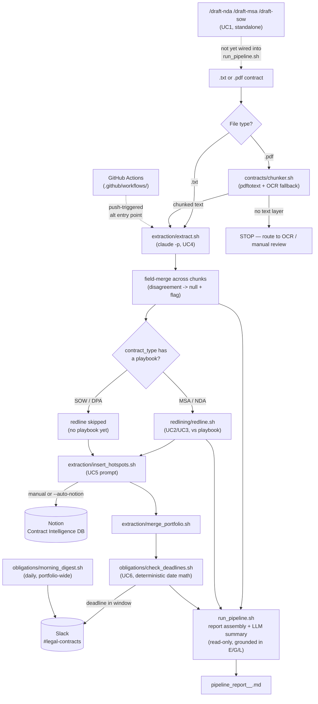

# ContractIQ — AI-Native Contract Lifecycle Workspace

An AI-native pipeline for lean in-house legal teams (2-5 lawyers) at mid-market
companies: **draft → redline → extract hotspots → insert to database → track
obligations.**

---

## Problem statement

In-house legal teams without a full enterprise CLM run their contract
lifecycle on blank-page drafting, redlines tracked by emailing
`v3_FINAL_v2.docx` back and forth, manual re-reading of signed PDFs to find
the terms that matter, and deadlines that get discovered too late because no
one was watching for them. None of that scales past a handful of lawyers, and
a missed liability cap, an auto-renewal nobody flagged, or a confidentiality
survival period nobody tracked has real financial and legal consequences —
not just an inconvenience.

ContractIQ replaces those four time sinks with one connected pipeline, sized
for a 2-5 lawyer team, without the headcount or implementation timeline of a
full enterprise CLM.

---

## What ContractIQ does

Six use cases, each mapped to a script/skill in this repo:

| UC | Scenario | Status | Entry point |
|----|---|---|---|
| UC1 | Draft a new NDA/MSA/SOW from a template | Fast-path prototype (markdown, not the final risk-tagged `.docx`) | `/draft-nda`, `/draft-msa`, `/draft-sow` |
| UC2 | Ingest and diff a counterparty redline | Prototype — single-document, playbook-driven comparison (MSA/NDA playbooks only) | `/redline-contract` |
| UC3 | Compare a counterparty ask against fallback history | Folded into the same redline prototype (playbook fallback positions), not a standalone precedent search yet | `/redline-contract` |
| UC4 | Extract hotspots at execution (22-field schema) | ✅ Working — single file or batch | `/extract-contract`, `extraction/parallel_extract.sh` |
| UC5 | Search the contract database | ✅ Notion database live; querying is manual today, not a dedicated search UI | Notion "Contract Intelligence" DB |
| UC6 | Deadline/obligation alerts | ✅ Working — tiered Slack alerts + a daily morning digest | `/check-renewals`, `obligations/morning_digest.sh` |

Supported contract types (v1): **NDA, MSA, SOW, DPA** (schema-level; DPA has
no playbook or drafter yet — see Limitations). Every extracted field follows
four non-negotiable rules from `CLAUDE.md`: never fabricate a value, output
`null` if a field is absent, always cite the source section/paragraph, and
flag ambiguous language for a human instead of silently resolving it.

`run_pipeline.sh` is the single command that chains all of UC4 → UC2/3 →
UC5 → UC6 for one contract file.

---

## Install in 3 steps

**1. Get the files**
```bash
git clone https://github.com/sahil1808agg/LegalTeam.git
cd LegalTeam
```

**2. Run the installer** — checks for Claude Code, `jq`, and Node.js, and
sets up the working folders (`extraction/output`, `redlining/output`,
`obligations/output`, etc.):
```bash
./install.sh
```
Re-run it as many times as you need until you see `Setup complete.`

**3. Start Claude Code from inside the repo**
```bash
claude
```
Everything else — drafting, redlining, extraction, obligations — runs as
slash commands or shell scripts from here. Ask *"what ContractIQ commands
are available?"* if you want the full list.

Two things the installer doesn't check but the full pipeline needs: a
**Notion MCP connection** (for UC5 inserts) and a **Slack MCP connection**
(for UC6 alerts) configured in Claude Code. Missing either one degrades
gracefully — see [What you get in the output](#what-you-get-in-the-output).

---

## Run your first pipeline

```bash
./run_pipeline.sh extraction/input/contract_2_nda.txt
```

That single command:
1. Detects `.txt` vs `.pdf` (PDFs are chunked first via `contracts/chunker.sh` — never read whole into context, per `CLAUDE.md`'s PDF Handling rule; a scanned PDF with no text layer stops the run and routes to OCR/manual review).
2. Extracts the 22-field hotspot schema (UC4), field-merging across chunks for large PDFs and flagging — never silently resolving — any field where chunks disagree.
3. Redlines the contract against the matching playbook (UC2/UC3) if one exists (`redlining/playbooks/msa_playbook.md` or `nda_playbook.md` — SOW/DPA have none yet, so that stage is skipped, not faked).
4. Prepares a Notion insert (UC5) — by default this **writes a prompt file for you to review and run**, rather than auto-writing to the shared database; pass `--auto-notion` to insert immediately.
5. Rebuilds the portfolio and scans it for renewal/expiry deadlines (UC6), posting a tiered Slack alert to `#legal-contracts` if anything falls within the lookahead window (default 90 days; pass `--skip-slack` to scan without posting).
6. Assembles everything into one report.

Useful flags: `--skip-redline`, `--skip-notion`, `--skip-slack`,
`--auto-notion`, `--days N` (obligations lookahead), `--slack-channel NAME`,
`--notion-db-id ID`. Run `./run_pipeline.sh --help` for the full list.

For single stages instead of the full chain:
```bash
./extraction/extract.sh contracts/sample.txt          # UC4 only
./redlining/redline.sh --incoming FILE --playbook redlining/playbooks/msa_playbook.md   # UC2/UC3 only
./obligations/check_deadlines.sh --days 90             # UC6 only
```

---

## What you get in the output

One `pipeline_report_<contract_stem>_<YYYY-MM-DD>.md` at the repo root per
run, with:

- **Executive Summary** (3 bullets) and **Next Steps** (prioritized, owner +
  deadline per item) — the only LLM-authored prose in the report, and it's
  read-only: grounded strictly in the three deterministic files below, never
  free to invent a fact.
- **Extracted Terms Table** — all 22 fields, each with its value, source
  citation (`Section X.Y` / `¶N`), and any ambiguity flag. Absent fields read
  *"Not stated in document"*, never a guess.
- **Redline Report** — clause-by-clause: standard position, counterparty
  position (cited), deviation, risk level (HIGH/MED/LOW), recommended
  response — or a note explaining why redlining was skipped.
- **Obligations Calendar** — renewal/expiry dates within the lookahead
  window, bucketed (0-30 / 31-60 / 61-90 days), each with a suggested action
  labeled "requires lawyer review," never an auto-executed decision.

Alongside the report, on disk:

- `extraction/output/<stem>_extracted.json` — the raw 22-field schema
- `redlining/output/<date>_redline_report_<stem>.md`
- `obligations/output/<stem>_snapshot_<date>.json`
- `extraction/output/master_portfolio.json` — the merged, searchable portfolio across every contract processed so far

Plus two live side effects, both opt-in/visible rather than silent:

- **Notion**: a prompt file at `/tmp/claude_insert_hotspots_<stem>.txt` you
  run with `claude < <file>` (or `--auto-notion` to skip the manual step) —
  reports back a CREATE/UPDATE decision, the record URL, and which fields
  were skipped as null.
- **Slack**: a tiered alert (`URGENT` <30 days, `ACTION_NEEDED` 30-60,
  `WATCH` 60-90) posted to the configured channel, only for tiers that
  actually have entries.

---

## Architecture



---

## Limitations

- **UC1 (drafting)** produces markdown from a fast-path script, not the
  `.docx` with per-clause `risk_level`/`source` tags the PRD calls for, and
  isn't wired into `run_pipeline.sh` — it's a separate entry point.
- **UC2/UC3 (redline)** is single-document, playbook-vs-incoming comparison.
  There's no structured diff stored back into the database, no fallback
  *history* search across past negotiations (just the playbook's stated
  fallback), and only MSA/NDA have playbooks — SOW and DPA redlines are
  skipped outright.
- **UC5 (search)** has no dedicated query UI; "search" today means opening
  the Notion database or reading `master_portfolio.json` directly. The
  Notion database's live schema has already drifted from the field list this
  repo's `CLAUDE.md` documents (`contract_type` is the title property, not a
  select; some boolean fields are stored as text) — each insert self-detects
  and adapts, but the schema and this doc should be reconciled.
- **Self-reported success is a real gap.** Scripts that call `claude -p` for
  Slack posting and Notion inserts detect success by grep-matching the
  model's own text (`posted|sent|success`), not by inspecting the tool-call
  result directly — a convincing but wrong summary could read as success.
  Verify anything high-stakes against the actual channel/database.
- **No automated test suite.** `tests/fixtures/` holds synthetic contracts
  for manual/agent-driven review; there's no CI-run assertion suite over
  extraction accuracy, redline correctness, or deadline math.
- **Single hardcoded Slack channel default** (`#legal-contracts`) and a
  single Notion database ID default — fine for one team, not multi-tenant.
- **PDF OCR fallback** depends on `pdftoppm` + `tesseract` being installed;
  without them, scanned PDFs just stop and flag for manual review (correct
  per `CLAUDE.md`, but there's no in-repo OCR path of its own).
- Everything here is a **decision-support tool reviewed by a lawyer**, not
  legal advice, and nothing is ever auto-sent to a counterparty or
  auto-applied to a live contract (see `CLAUDE.md` Redline Rules 3 and 6).

## Roadmap

Roughly in the order the PRD's Definition of Done gaps suggest:

1. **Close the UC1 gap** — `.docx` output with per-clause `risk_level`/
   `source` tags, wired into `run_pipeline.sh` as the front door for new
   contracts, not just executed ones.
2. **Real UC2/UC3 diff engine** — pick build-vs-buy (open question in
   `PRD.md`), store structured diffs against the canonical version (never
   round-over-round, per Redline Rule 1), and add the fallback-position
   *history* search UC3 actually calls for.
3. **DPA and SOW playbooks** so redline coverage matches the full four
   contract types the schema already supports.
4. **Reconcile the Notion schema** with `CLAUDE.md`'s 22-field spec (or
   update the spec to match reality) and add a real UC5 search/filter
   surface instead of raw database browsing.
5. **Replace grep-based success detection** for Slack/Notion posts with a
   check against the actual MCP tool-call result, not the model's prose.
6. **CI test suite** over the synthetic fixtures — extraction accuracy,
   citation coverage (already required by `CLAUDE.md` for PRs touching
   `extraction/`, `redline/`, `drafting/`, just not automated yet), and
   deadline-math regression tests for `obligations/lib_deadlines.sh`.
7. **Multi-tenant config** — per-company Slack channel, Notion database, and
   risk thresholds (`config/risk_thresholds/`) instead of shared defaults.

---

## Documentation

- **[CLAUDE.md](CLAUDE.md)** — operating contract: legal accuracy rules, extraction schema, redline rules, coding conventions
- **[PRD.md](PRD.md)** — product requirements, all six use cases, out-of-scope list
- **[INSTALL.md](INSTALL.md)** — the non-technical install walkthrough this README's Install section summarizes
- **[security_policy.md](security_policy.md)** / **[security_audit.md](security_audit.md)** — data classification and tool-permission audit
- **Notion "Contract Intelligence" database** — live contract repository (ask for the link; the database ID is also in `.claude/settings.json`)
